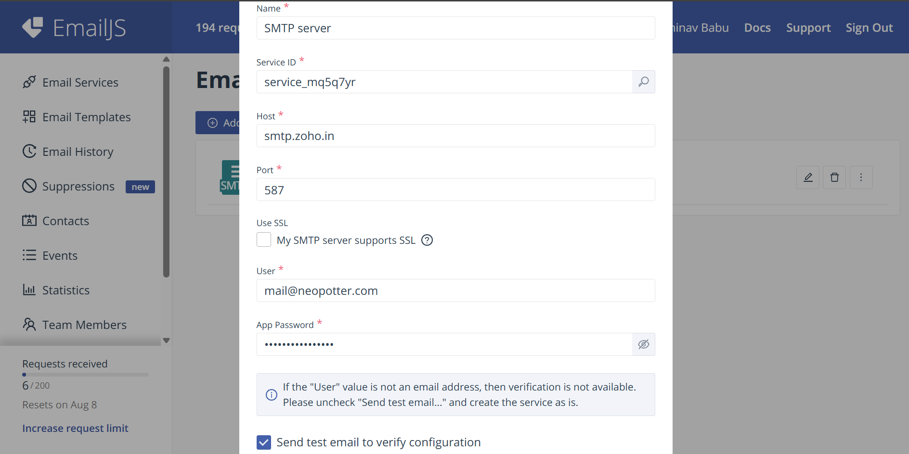
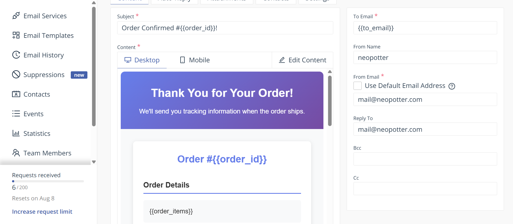

# Neopotter

This is a simple static website.
The order email is send to the admin(orders@neopotter.com) with Formsubmit.co.
The confirmation email is sent with emailjs (reason: better formatting, Formsubmit autoresponse didn't work)
To log into emailjs, use the email abhinavbabu.contact@gmail.com.
The email is hosted with zoho mail.
The domain is provided with Dynadot.

## Note
the file size of og image (thumbnail for whatsapp links) must be less than 300 kb.

## Setup the "Email service" in emailjs
1. Go to emailjs
2. log in as abhinavbabu.contact@gmail.com
3. Go to Email services >> add new service >> SMTP server
4. Fll it in as follows
   
5. Go to Email templates and add this [template](emailjs_template.html)
   Note: set 'to email' as {{to_email}} and from email as mail@neopotter.com as in the screenshot
    

6. Service ID, Template ID and Public Key must be substituted from emailjs to the html code of the website.
